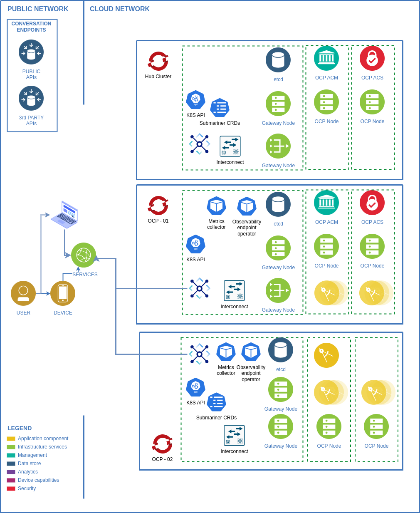
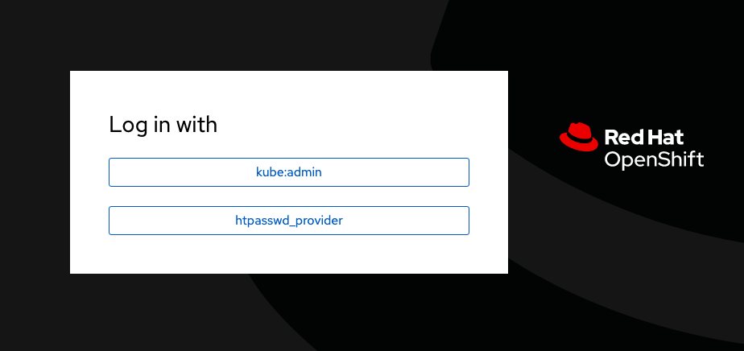
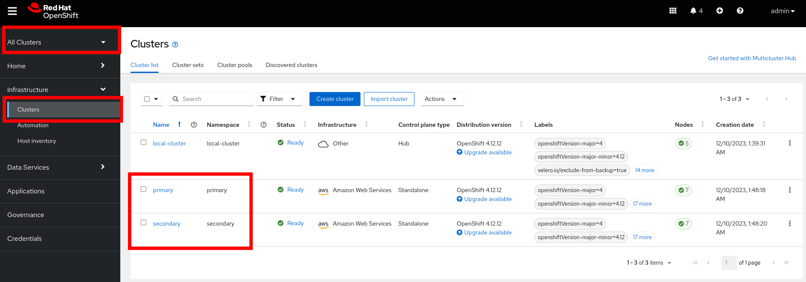
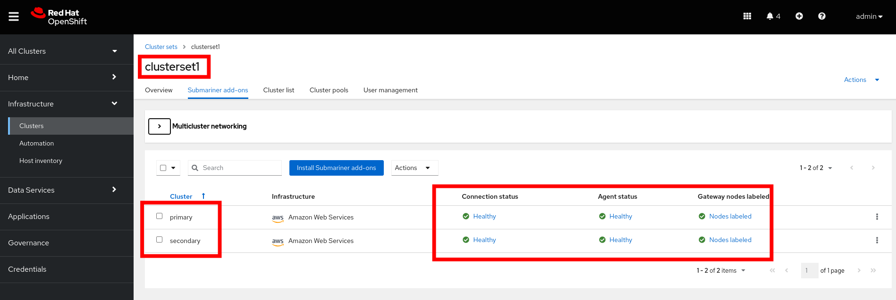
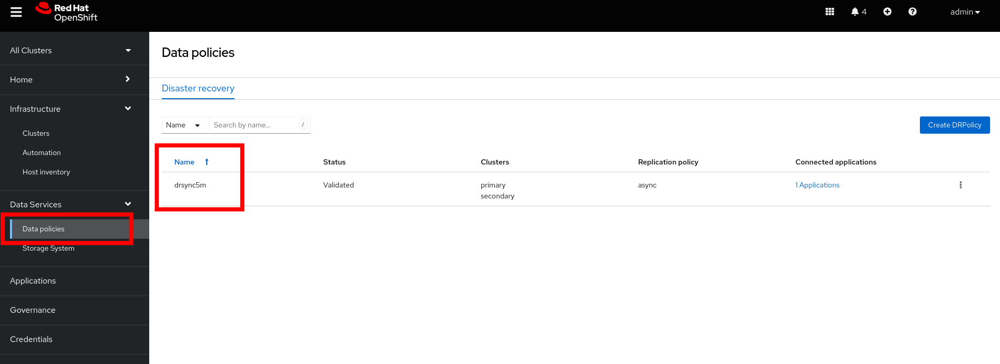
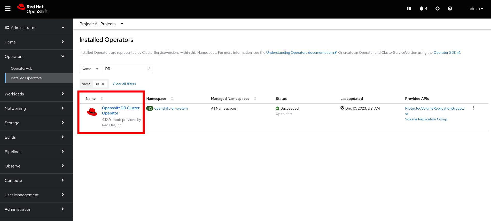

# Hybrid_cloud_ecosystems

## Justification

Implementing microservices offers numerous benefits, but also presents challenges and potential problems when an architectural framework of microservices as ecosystems is not established.
Some of the current problems when implementing microservices include:

1. Management Complexity:

Microservices present greater complexity in the management of multiple independent services, each with its own database and business logic. Coordinating and managing these pieces can be challenging.
`Reference: Lewis, J. and Fowler, M. (2014). Microservices: a definition of this new architectural term.`

2. Consistency and Distributed Transactions:

Maintaining data consistency in a microservices environment, especially in operations that involve distributed transactions, can be complicated and require specific solutions.
`Reference: Newman, S. (2015). Building microservices: detailed system design.`

3. Security and Data Protection:

Managing security in a microservices environment, involving multiple services and entry points, can be challenging. Data protection and authentication must be carefully considered.
`Reference: Richardson, C. (2018). Microservices security in action.`

4. Monitoring and Follow-up:

Tracking and monitoring distributed microservices can be complex. Specialized solutions are required to understand system-wide performance and issues.
`Reference: Burns, B. (2019). Distributed Systems Design: Patterns and Paradigms for Scalable and Reliable Services.`

5. Testing and Continuous Deployment:


Implementing effective testing and continuous deployment strategies for microservices can be more complicated than in monolithic architectures, especially given the need to test interactions between services.
`Reference: Newman, S. (2015). Building microservices: detailed system design.`

6. Cultural and Organizational Change:

Adopting a microservices architecture often involves a significant cultural and organizational change. Organizations must adapt to a small, independent team mentality.
`Reference: Fowler, M. and Lewis, J. (2018). Microservices: the dark side.`

7. Network Overload and Latency:

Communication between microservices can introduce latency, and a poorly designed architecture can result in network overload, affecting overall performance.
`Reference: Newman, S. (2015). Building microservices: detailed system design.`

8. Duplication of Functionalities and Waste of Resources:

Fragmentation of services can lead to duplication of functionality, which can result in wasted resources and development efforts.
`Reference: Richardson, C. (2018). Microservices Patterns: With examples in Java.`

It is important to address these problems with a strategic approach and consider specific solutions to mitigate the challenges associated with the implementation of microservices in an enterprise environment, which is why it is important to undertake research on microservices implementation that reduces the impact of the aforementioned problems. . .

## Architecture



The lab consists of three Red Hat OpenShift Clusters.

1. Hub Cluster
2. Primary Cluster (OCP-01)
3. Secondary Cluster (OCP-01)

### AWS
This lab is designed to run on an OpenShift 4 cluster that has been completely installed by the new installer. You will need access to AWS with sufficient permissions and limits to deploy the 3 masters, 4-6 regular nodes,
and NVME-equipped nodes for storage.

Check out the
[documentation](https://docs.openshift.com/container-platform/latest/installing/installing_aws/installing-aws-default.html)
for _Installing on AWS_.

### OpenShift 4
At this time an OpenShift 4 cluster can be obtained by visiting
https://try.openshift.com -- a free "subscription" to / membership in the
developer program is required.

### Red Hat Advanced Cluster Management for Kubernetes

Red Hat Advanced Cluster Management for Kubernetes provides end-to-end management visibility and control to manage your Kubernetes environment. Take control of your application modernization program with management capabilities for cluster creation, application lifecycle, and provide security and compliance for all of them across hybrid cloud environments. Clusters and applications are all visible and managed from a single console, with built-in security policies. Run your operations from anywhere that Red Hat OpenShift runs, and manage any Kubernetes cluster in your fleet.

With Red Hat Advanced Cluster Management for Kubernetes:

1. Work across a range of environments, including multiple data centers, private clouds and public clouds that run Kubernetes clusters.
2. Easily create Kubernetes clusters and offer cluster lifecycle management in a single console.
3. Enforce policies at the target clusters using Kubernetes-supported custom resource definitions.
4. Deploy and maintain day-two operations of business applications distributed across your cluster landscape.

Red Hat Advanced Cluster Management (RHACM) provides the ability to manage multiple clusters and application lifecycles. Hence, it serves as a control plane in a multi-cluster environment.

1. RHACM is split into two parts:
2. RHACM Hub: components that run on the multi-cluster control plane.
Managed clusters: components that run on the clusters that are managed.

### OpenShift Data Foundation

OpenShift Data Foundation provides the ability to provision and manage storage for stateful applications in an OpenShift Container Platform cluster.

OpenShift Data Foundation is backed by Ceph as the storage provider, whose lifecycle is managed by Rook in the OpenShift Data Foundation component stack. Ceph-CSI provides the provisioning and management of Persistent Volumes for stateful applications.

OpenShift Data Foundation stack is now enhanced with the following abilities for disaster recovery:

1. Enable RBD block pools for mirroring across OpenShift Data Foundation instances (clusters)
2. Ability to mirror specific images within an RBD block pool
3. Provides csi-addons to manage per Persistent Volume Claim (PVC) mirroring

### OpenShift DR
Red Hat OpenShift Data Foundation Regional Disaster Recovery (Regional-DR) solution along with the steps and commands necessary to be able to failover an application from one OpenShift Container Platform cluster to another and then failback the same application to the original primary cluster.

Regional-DR is composed of Red Hat Advanced Cluster Management for Kubernetes and OpenShift Data Foundation components to provide application and data mobility across Red Hat OpenShift Container Platform clusters.

> **_NOTE:_** Regional-DR is supported with OpenShift Data Foundation 4.14 and Red Hat Advanced Cluster Management for Kubernetes 2.9 combinations only.

OpenShift DR is a set of orchestrators to configure and manage stateful applications across a set of peer OpenShift clusters which are managed using RHACM and provides cloud-native interfaces to orchestrate the life-cycle of an application’s state on Persistent Volumes. These include:

- Protecting an application and its state relationship across OpenShift clusters
- Failing over an application and its state to a peer cluster
- Relocate an application and its state to the previously deployed cluster

OpenShift DR is split into three components:

1. ODF Multicluster Orchestrator: Installed on the multi-cluster control plane (RHACM Hub), it orchestrates configuration and peering of OpenShift Data Foundation clusters for Metro and Regional DR relationships
2. OpenShift DR Hub Operator: Automatically installed as part of ODF Multicluster Orchestrator installation on the hub cluster to orchestrate failover or relocation of DR enabled applications.
3. OpenShift DR Cluster Operator: Automatically installed on each managed cluster that is part of a Metro and Regional DR relationship to manage the lifecycle of all PVCs of an application.

# Deploying the Lab Guide

Deploying the lab guide will take three steps. First, you will need to get
information about your cluster. Second, you will build a container based on your lab.
Third, you will deploy the lab guide using the information you found so that proper
URLs and references are automatically displayed in the guide.

> **_NOTE:_** This part of the laboratory has already been provisioned, to focus on the deployment of the ecosystem's own services. Items marked with a ^ have already been implemented.

## Requirements / Prerequisites

Most of the information can be found in the output of the installer.

### Requirements

* Python (3.5.3)
* awscli (1.11.109-2.fc25) Fedora
* click (6.7)
* pip (9.0.1)
* setuptools (36.2.4)
* wheel (0.30.0a0)
* ansible (7.7.0-1)

<details>
<summary> ^ Install packages </summary>

```sh
sudo dnf install -y ansible
sudo dnf install -y awscli awscli2
sudo dnf install -y python pip python3-wheel python3-click 
sudo dnf install -y setuptool
ansible-playbook submariner/submarinercli-install.yml
```
</details>

<details>
<summary> ^ Required Environment Variables </summary>

#### Explaination and examples
- `API_URL` - URL to access API of the cluster
    - `https://api.cluster-gu1d.sandbox101.opentlc.com:6443`
- `MASTER_URL` - Master Console URL
    - `http://console-openshift-console.apps.cluster-gu1d.sandbox101.opentlc.com`
- `KUBEADMIN_PASSWORD` - Password for `kubeadmin`
- `SSH_PASSWORD` - password for ssh into bastion
- `ROUTE_SUBDOMAIN` - Subdomain that apps will reside on
    - `apps.cluster-gu1d.sandbox101.opentlc.com:6443`
    - `apps.mycluster.company.com`

Specific to Red Hat internal systems
- `GUID` - GUID
    - `gu1d`
- `BASTION_FQDN` - Bastion Domain Name
    - `bastion.gu1d.sandbox101.opentlc.com`

Create a file called `workshop-settings.sh` using the values of your environment. Here is an example.

> :warning: For `export` ensure [special characters](http://mywiki.wooledge.org/BashGuide/SpecialCharacters) are escaped (ie. use `\!` in place of `!`).

```bash
export API_URL=https://api.openshift4.example.com:6443
export MASTER_URL=https://console-openshift-console.apps.openshift4.example.com
export KUBEADMIN_PASSWORD=IqJK7-o3hYR-ZTr6c-7sztN
export SSH_USERNAME=lab-user
export SSH_PASSWORD=apassword
export BASTION_FQDN=foo.bar.com
export GUID=XXX
export ROUTE_SUBDOMAIN=apps.openshift4.example.com
export HOME_PATH=/opt/app-root/src
export USER=[asigned user]
export SUBMARINER-PATH="$PATH:~/.local/bin"
```
</details>

<details>
<summary> ^ Storage </summary>

Persistent storage requirement is key to many application and to achieve disaster recovery for such applications, data replication becomes very important. In this lab we will leverage Red Hat OpenShift Data Foundations Storage.

</details>

<details>
<summary> ^ Configure LAB </summary>

Now that you have the `workshop/workshop-settings.sh` file with the various required variables, you can deploy the lab guide into your cluster.

First, clone the repo:

> **_NOTE:_** Remember to checkout the branch you want to test against.

```shell
git clone https://github.com/openshiftdemos/openshift-ops-workshops
```

Next, Build a container using the repo/branch you checked out.

```shell
cd openshift-ops-workshops
export QUAY_USER=myusername
export BRANCH=$(git branch --show-current)
podman build -t quay.io/${QUAY_USER}/lab-hybrid-cloud-ecosystems:${BRANCH} .
```

Now, login to quay (it's free to sign up) or another registry your cluster has access to.

```shell
podman login quay.io
```

Next push your container to your repo.

```shell
podman push quay.io/${QUAY_USER}/lab-hybrid-cloud-ecosystems:${BRANCH}
```

You will use this image to deploy the lab. The following command will log you in as `kubeadmin` on systems with `oc` client installed:

```bash
oc login -u kubeadmin -p $KUBEADMIN_PASSWORD

oc new-project lab-ocp-hce

# This part is needed if you're running on a "local" or "self-provisioned" cluster
oc adm policy add-role-to-user admin kube:admin -n lab-ocp-hce

# Create deployment.
oc new-app -n lab-ocp-hce https://raw.githubusercontent.com/redhat-cop/agnosticd/development/ansible/roles/ocp4-workload-workshop-admin-storage/files/production-cluster-admin.json \
--param TERMINAL_IMAGE="quay.io/${QUAY_USER}/lab-hybrid-cloud-ecosystems:${BRANCH}" --param PROJECT_NAME="lab-ocp-hce" \
--param WORKSHOP_ENVVARS="$(cat ./workshop/workshop-settings.sh)"

# Wait for deployment to finish.

oc rollout status dc/dashboard -n lab-ocp-hce
```

If you made changes to the container image and want to refresh your deployed Homeroom quickly, execute this:

```shell
oc import-image -n lab-ocp-hce dashboard
```

</details>

<details>
<summary> ^ Doing and follow the lab </summary>

Your lab guide should deploy in a few moments. To find its url, execute:

```bash
oc get route dashboard -n lab-ocp-hce
```

You should be able to visit that URL and see the lab guide. From here you can
follow the instructions in the lab guide.

## Notes and Warnings
Remember, this experience is designed for a provisioning system internal to
Red Hat. Your lab guide will be mostly accurate, but slightly off.

* You aren't likely using `lab-user`
* You will probably not need to actively use your `GUID`
* You will see lots of output that references your `GUID` or other slightly off
  things
* Your `MachineSets` are different depending on the EC2 region you chose

But, generally, everything should work. Just don't be alarmed if something
looks mostly different than the lab guide.

Also note that the first lab where you SSH into the bastion host is not
relevant to you -- you are likely already doing the exercises on the host
where you installed OpenShift from.

Logon to the Hub Cluster ACM, OCP-01 and OCP-02 console using your OpenShift credentials.

Go to the OpenShift console and log in with your credentials username: admin and password: [PASSWORD] `DevNationDayDec12``



</details>

<details>
<summary> Troubleshooting </summary>

Make sure you are logged-in as kubeadmin when creating the project

If you are getting _too many redirects_ error then clearing cookies and
re-login as kubeadmin. This usually happens if you're using RHPDS and
stopped/started a cluster.

</details>

<details>
<summary> Cleaning up </summary>

To delete deployment run
```
oc delete all,serviceaccount,rolebinding,configmap -l app=admin -n lab-ocp-hce
```
</details>

<details>
<summary> Get materials </summary>

First, clone the repo

> **NOTE** Remember to checkout the branch you want to test against

```shell
git clone https://github.com/psehgaft/Hybrid_cloud_ecosystems
```
</details>


## 1. Management Complexity

> **_NOTE:_** This part of the laboratory has already been provisioned, to focus on the deployment of the ecosystem's own services. Items marked with a ^ have already been implemented.

<details>
<summary> Hub cluster </summary>

The hub cluster is the common term that is used to define the central controller that runs in a Red Hat Advanced Cluster Management for Kubernetes cluster. From the hub cluster, you can access the console and product components, as well as the Red Hat Advanced Cluster Management APIs. You can also use the console to search resources across clusters and view your topology.

The Red Hat Advanced Cluster Management hub cluster uses the MultiClusterHub operator to manage, upgrade, and install hub cluster components and runs in the open-cluster-management namespace. The hub cluster aggregates information from multiple clusters by using an asynchronous work request model and search collectors. The hub cluster maintains the state of clusters and applications that run on it.

The local cluster is the term used to define a hub cluster that is also a managed cluster, discussed in the following sections.

</details>

<details>
<summary> Managed cluster </summary>

The managed cluster is the term that is used to define additional clusters that are managed by the hub cluster. The connection between the two is completed by using the klusterlet, which is the agent that is installed on the managed cluster. The managed cluster receives and applies requests from the hub cluster and enables it to service cluster lifecycle, application lifecycle, governance, and observability on the managed cluster.

</details>

<details>
<summary> Cluster lifecycle </summary>

Red Hat Advanced Cluster Management cluster lifecycle defines the process of creating, importing, managing, and destroying Kubernetes clusters across various infrastructure cloud providers, private clouds, and on-premises data centers.

The cluster lifecycle function is provided by the multicluster engine for Kubernetes operator, which is installed automatically with Red Hat Advanced Cluster Management. See Cluster lifecycle introduction for general information about the cluster lifecycle function.

</details>

<details>
<summary> Implementation objetives </summary>

You can use either the OpenShift 4 web console's built-in OperatorHub or the OpenShift CLI to install ACM. The installation breaks down to six steps:

1. Prepare the environment for the ACM installation.
2. Create a new OpenShift project and namespace.
3. Create an image-pull secret.
4. Install ACM and subscribe to the ACM Operator group.
5. Create the MultiClusterHub resource.
6. Verify the ACM installation.

These steps are already executed for you during the lab setup except for the application onboarding which is the next lab.

1. *Install the ACM operator on the hub cluster:* After creating the OCP hub cluster, install from OperatorHub the ACM operator. After the operator and associated pods are running, create the MultiClusterHub resource.

2. *Create or import managed OCP clusters into ACM hub:* Import or create the two managed clusters with adequate resources for ODF (compute nodes, memory, cpu) using the RHACM console.

3. *Ensure clusters have unique private network address ranges:* Ensure the primary and secondary OCP clusters have unique private network address ranges.

</details>

<details>
<summary> ^ Deploy Advanced Cluster Management for Kubernetes </summary>

We will use the OpenShift command line for the first several steps; . then, I will show you how to use either the command line or the OpenShift 4 web console.

```vars.yml
ansible-playbook lab-deployment.yml --tags acm
```
</details>
<details>
<summary> Verify </summary>

Select All Clusters and verify that you can see local and two managed clusters - primnary and secondary


</details>


## 2. Consistency and Distributed Transactions

> **_NOTE:_** This part of the laboratory has already been provisioned, to focus on the deployment of the ecosystem's own services. For this section only the validation part has to be carried out.

<details>
<summary> Implementation objetives </summary>

These steps are already executed for you during the lab setup except for the application onboarding which is the next lab.

1. *Connect the private networks using Submariner add-ons:* Connect the managed OCP private networks (cluster and service) using the RHACM Submariner add-ons.

2. *Install ODF 4.14 on managed clusters:* Install ODF 4.12 on primary and secondary OCP managed clusters and validate deployment.

3. *Install ODF Multicluster Orchestrator on the ACM hub cluster:* Install from OperatorHub on the ACM hub cluster the ODF Multicluster Orchestrator. The OpenShift DR Hub operator will also be installed.

4. *Configure SSL access between S3 endpoints:* If managed OpenShift clusters are not using valid certificates this step must be done by creating a new user-ca-bundle ConfigMap that contains the certs.

</details>

<details>
<summary> ^ Deploy Submariner </summary>

```sh
sudo dnf install -y ansible
sudo dnf install -y awscli awscli2
sudo dnf install -y python pip python3-wheel python3-click 
sudo dnf install -y setuptool
ansible-playbook submariner/submarinercli-install.yml
```
</details>

<details>
<summary> Validate non-overlapping networks </summary>

In [OCP-01] and [OCP-02] we validate:

```sh
oc get networks.config.openshift.io cluster -o json | jq .spec
```
Example output

```shell
{
  "clusterNetwork": [
    {
      "cidr": "10.128.0.0/14",
      "hostPrefix": 23
    }
  ],
  "externalIP": {
    "policy": {}
  },
  "networkType": "OpenShiftSDN",
  "serviceNetwork": [
    "172.30.0.0/16"
  ]
}
```

Now that we know the cluster and service networks have non-overlapping ranges, it is time to verify the Submariner add-ons for each managed cluster.

</details>

<details>
<summary> Verify that the Managed clusters using Submariner add-ons </summary>

Navigate on All Cland Click *ALL CLUSTERS* > *InfraSturcture* > *Clusters*.
Select *Cluster Sets* tab and in *cluster sets* select *clusterset1* and *Submariner add-ons tab*. 
A successful deployment will show Connection status and *Agent status* as *Healthy* for both *OCP-01* and *OCP-02*.



</details>

## 3. Security and Data Protection

**_NOTE:_** This part of the laboratory has already been provisioned, to focus on the deployment of the ecosystem's own services. For this section only the validation part has to be carried out.

<details>
<summary> Governance </summary>

Governance enables you to define policies that either enforce security compliance, or inform you of changes that violate the configured compliance requirements for your environment. Using dynamic policy templates, you can manage the policies and compliance requirements across all of your management clusters from a central interface.

</details>

<details>
<summary> ^ Deploy Advanced Cluster Security for Kubernetes </summary>

When RHACM is available, you can create RHACM policies to deploy RHACS to your cluster fleet. This approach ensures that all fleet clusters are protected by RHACS.

To implement RHACS, you must create two policies in RHACM, one for centralized services and one for protected cluster services. The policy to install centralized services must be applied to the hub cluster. The policy for installing protected cluster services must be applied to the clusters that you want RHACS to protect. You can achieve this separation by using a clusterSelector parameter of the PlacementRule object.

```vars.yml
ansible-playbook lab-deployment.yml --tags acs
```
</details>

<details>
<summary> Disaster recovery </summary>

Organizations running critical applications on Red Hat OpenShift Container Platform need a business continuity plan for site and regional disasters that goes beyond cluster failover or backup and recovery. Your implementation should provide data resiliency and take into account continuous application deployment practices as part of overall enterprise GitOps strategies.

Disaster recovery (DR) helps an organization recover and resume business-critical functions or normal operations when there are disruptions or disasters.

1. We will use an application part of the OpenE-Comerce ecosystem that sells products online.
You will learn how to deploy and configure this application for business continuity.
2. We will test data persistence in failover/relocation (failback) scenarios by updating the data in the database. Verify that data is consistent and available after transition from one site/cluster to another.
3. We incorporated a sample application to be part of the disaster recovery strategy and test failover/relocation (failback).

Regional-DR is composed of Red Hat Advanced Cluster Management for Kubernetes and OpenShift Data Foundation components to provide application and data mobility across Red Hat OpenShift Container Platform clusters.

</details>

<details>
<summary> Implementation objetives </summary>

These steps are already executed for you during the lab setup except for the application onboarding which is the next lab.

1. *Create one or more DRPolicy:* Use the All Clusters Data Services UI to create DRPolicy by selecting the two managed clusters the policy will apply to.

2. *Validate OpenShift DR Cluster operators are installed:* Once the first DRPolicy is created this will trigger the DR Cluster operators to be created on the two managed clusters selected in the UI.

3. *failover/relocate:* Setup an application using RHACM console and test failover/relocate.

</details>

<details>
<summary> ^ Deploy Openshift Data Protection </summary>

When RHACM is available, you can create RHACM policies to deploy RHACS to your cluster fleet. This approach ensures that all fleet clusters are protected by RHACS.

To implement RHACS, you must create two policies in RHACM, one for centralized services and one for protected cluster services. The policy to install centralized services must be applied to the hub cluster. The policy for installing protected cluster services must be applied to the clusters that you want RHACS to protect. You can achieve this separation by using a clusterSelector parameter of the PlacementRule object.

```vars.yml
ansible-playbook lab-deployment.yml --tags oadp
```
</details>

<details>
<summary> ^ Backup </summary>

This is necessary so that metadata can be stored on the alternate cluster in a Multi-Cloud Gateway (MCG) object bucket using a secure transport protocol and in addition the Hub cluster needs to verify access to the object buckets.

> **_NOTE:_** If all of your OpenShift clusters are deployed using signed and valid set of certificates for your environment then this specific step can be skipped during implementation.

</details>

<details>
<summary> Validate OpenShift Data Foundation </summary>

In [OCP-01] and [OCP-02] we validate:

Validate the successful deployment of ODF on each managed OCP cluster with the following command:

```sh
oc get storagecluster -n openshift-storage ocs-storagecluster -o jsonpath='{.status.phase}{"\n"}'
```

Validate Multi-Cluster Gateway (MCG) status:

```sh

oc get noobaa -n openshift-storage noobaa -o jsonpath='{.status.phase}{"\n"}'
```
</details>

<details>
<summary> Validate ODF Multicluster Orchestrator Operator on Hub cluster </summary>

Check to see the following operators Pod are in a Running state. You may also see other operator pods which are not related to Regional DR configuration.

For Hub:

```sh
oc get pods -n openshift-operators
```
</details>

<details>
<summary> Validate Data Policy on Hub cluster </summary>

On the Hub cluster navigate and select *All Clusters* > *Data policies* under Data services menu. 
If this your first DRPolicy created you will see *Create* DRpolicy at the bottom of the page, else you will the the already created DRPolicy.

> **_NOTE:_** Make sure you can access all clusters from the *Multicluster Web console*. The clusters will be directly below All Clusters.

Click on Data policies and review the already created drpolicy.


```sh
oc get pods -n openshift-operators
```



Note that the Replication policy will automatically be selected as async based on the OpenShift clusters selected and a Sync schedule will be available. The replication interval for this dr policy is 5 minutes. You can check by clicking 3 dots on the right side of drsync5m data policy and select Edit DR Policy. Please do not update anything here, once you review the content of the yaml file, just cancel the selection so that there is no update to the DR Policy.

- Creating a new DR Policy also creates the two DRCluster resources and also the DRPolicy on the Hub cluster. In addition, when the initial DRPolicy is created the following will happen:

- Create a bootstrap token and exchanges this token between the managed clusters.

- Enable mirroring for the default CephBlockPool on each managed clusters.

- Create a *VolumeReplicationClass* on the *OCP-01 managed cluster* and the *OCP-02 Secondary managed cluster* for the replication interval in the DRPolicy.

- An object bucket created (using MCG) on each managed cluster for storing *PVC* and *PV* metadata.

- A *Secret* created in the openshift-operators project on the *Hub cluster* for each new object bucket that has the base64 encoded access keys.

- The ramen-hub-operator-config *ConfigMap* on the *Hub cluster* is modified with s3StoreProfiles entries.

- The OpenShift DR Cluster operator will be deployed on each managed cluster in the openshift-dr-system project.

- The object buckets *Secrets* on the *Hub cluster* in the project openshift-operators will be copied to the managed clusters in the openshift-dr-system project.

- The s3StoreProfiles entries will be copied to the managed clusters and used to modify the ramen-dr-cluster-operator-config *ConfigMap* in the openshift-dr-system project.

To validate that the *DRPolicy* is created successfully run this command on the *Hub cluster* for the each *Data Policy* resource created.

> **_NOTE:_** Replace <drpolicy_name> with your unique name.

For Hub (drpolicy name is <policy_name>):

```sh
oc get drpolicy <policy_name> -o jsonpath='{.status.conditions[].reason}{"\n"}'
```

To validate object bucket access from the *Hub cluster* to both the *OCP-1 Primary managed cluster* and the *OCP-02 Secondary managed cluster* first get the names of the DRClusters on the *Hub cluster*.

Now test S3 access to each bucket created on each managed cluster using this DRCluster validation command.

> **_NOTE:_** Replace <drcluster_name> with your unique name.

```sh
oc get drcluster <drcluster_name_OCP-01> -o jsonpath='{.status.conditions[2].reason}{"\n"}'

oc get drcluster <drcluster_name_OCP-02> -o jsonpath='{.status.conditions[2].reason}{"\n"}'
```

> **_NOTE:_** Make sure to run command for both *DRClusters* on the *Hub cluster*.

To validate that the OpenShift DR Cluster operator installation was successful on the *OCP-01 Primary managed cluster* and the *OCP-02 Secondary managed cluster* check for *CSV* *odr-cluster-operator* and pod *ramen-dr-cluster-operator* by running the following command:

On OCP-01 and OCP-02

```sh
oc get csv,pod -n openshift-dr-system
```

You can also go to *OperatorHub* on each of the managed clusters and look to see the OpenShift DR Cluster Operator is installed.



Validate the status of the ODF mirroring daemon health on the Primary managed cluster and the Secondary managed cluster.

On OCP-01 and OCP-02

```sh
oc get cephblockpool ocs-storagecluster-cephblockpool -n openshift-storage -o jsonpath='{.status.mirroringStatus.summary}{"\n"}'
```

> **_NOTE:_** It could take up to 10 minutes for the daemon_health and health to go from Warning to OK. If the status does not become OK eventually then use the ACM console to verify that the Submariner connection between managed clusters is still in a healthy state.

</details>

## 4. Monitoring and Follow-up

**_NOTE:_** This part of the laboratory has already been provisioned, to focus on the deployment of the ecosystem's own services. For this section only the validation part has to be carried out.

<details>
<summary> Observability </summary>

The Observability component collects and reports the status and health of the OpenShift Container Platform version 4.x or later, managed clusters to the hub cluster, which are visible from the Grafana dashboard. You can create custom alerts to inform you of problems with your managed clusters. Because it requires configured persistent storage, Observability must be enabled after the Red Hat Advanced Cluster Management installation.

</details>

<details>
<summary> Deploy Openshift Monitoring </summary>

```vars.yml
ansible-playbook lab-deployment.yml --tags acs
```
</details>
<details>
<summary> Deploy Openshift Logging </summary>

```vars.yml
ansible-playbook lab-deployment.yml --tags acs
```
</details>
<details>
<summary> Deploy Thanos </summary>

```vars.yml
ansible-playbook lab-deployment.yml --tags thanos
```
</details>

## 5. Testing and Continuous Deployment

<details>
<summary> Implementation objetives </summary>

These steps are already executed for you during the lab setup except for the application onboarding which is the next lab.

1. Create an application using RHACM console for highly available application across regions.

2. Test failover and reolcate operations using the sampole application between managed clusters.

</details>

## 6. Cultural and Organizational Change

The importance of industry verticals can vary depending on the context, region, and the current economic and technological landscape. However, here we will focus on a list of some of the diverse and historically important industrial sectors that have played an important role in economies around the world:

<details>
<summary> Open industries </summary>

0. **(Open Ecosistems services) Generic/transversal microservices:** Generic and transversal microservices, common services to energize the ecosystems of the industries.

1. **(Open IT and Open AI) Technology and IT:** This sector includes hardware, software, telecommunications and Internet-related companies. It has been a major driver of economic growth and innovation in recent decades.

2. **(Open Banking) Finance and banking:** The financial industry encompasses banks, insurance companies, investment companies and more. It plays a crucial role in managing money and providing financial services.

3. **(Open Insurance) Healthcare:** Healthcare includes hospitals, pharmaceutical companies, biotechnology companies, and medical device manufacturers. It is essential to maintain public health and well-being.

4. **(Open Energy) Energy:** This sector involves the production, distribution and consumption of energy resources, including oil, gas, renewable energy sources and utilities.

5. **(Open Manufacturing) Manufacturing:** Manufacturing covers a wide range of industries, from automotive and aerospace to the production of consumer electronics and heavy machinery.

6. **(Open Agriculture) Agriculture and Food:** This sector includes agriculture, food processing and distribution. It is essential to feed the world population.

7. **(Open Transportation and logistics) Transportation and logistics:** Transportation and logistics covers everything from shipping and freight to airlines and public transportation systems.

8. **(Open E-Commerce) Retail:** Retail businesses encompass physical stores and e-commerce platforms, which sell a variety of products to consumers.

9. **(Open Real Estate) Real Estate:** Real estate includes residential, commercial and industrial properties, as well as property development and management.

10. **(Open Media and Entertainment) Entertainment and media:** This sector covers film, television, music, publishing, games and other forms of entertainment and information dissemination.

11. **(Open Infrastructure and Construction) Construction and Infrastructure:** Involves the construction of buildings, roads, bridges and other infrastructure projects.

12. **(Open Education) Education:** The education industry includes schools, universities, online education platforms, and educational technology companies.

13. **(Open Traveling) Hospitality and Tourism:** This sector includes hotels, restaurants, travel agencies and tourist destinations.

14. **(Open Government) Government and public services:** Government agencies and public services, such as healthcare, education, and law enforcement, are essential to the functioning of society.

15. **(Open Eco) Environment and sustainability:** With growing concerns about climate change, this sector focuses on renewable energy, green technologies and conservation efforts.

16. **(Open Telecommunications) Telecommunications: **Telecommunications companies provide communication services through wired and wireless networks.

17. **(Open Pharmaceutical) Pharmaceuticals and Healthcare Research:** This subset of healthcare focuses on drug discovery, medical research, and the pharmaceutical industry.

18. **(Open E-Retail) Consumer Goods:** Consumer goods include everyday products such as clothing, electronics, and household items.

19. **(Open Automotive) Automotive:** The automotive industry involves the manufacturing and sale of vehicles, including cars, trucks, and electric vehicles.

20. **(Open Legal Services) Legal services:** Legal firms and services provide legal advice, representation and support to individuals and companies.

The importance of these industry verticals may change over time due to technological advances, economic changes, and global events. Additionally, new industries and sectors may emerge as society evolves and new needs arise. Therefore, the relative importance of these industry verticals may vary by region and time period.
</details>

## 7. Network Overload and Latency

### Hybrid Cloud Balancing

### Deploy Skupper Operator

If you want to try a cluster-wide installation, you don't need to create the `OperatorGroup` as it is already defined at the destination namespaces, so you just need to create the subscription at the correct namespaces, see below.

```sh
# Create a Project
oc new-project "{{ username }}"

# Creating a CatalogSource in the `openshift-marketplace` namespace
oc apply -f ocp/00-CatalogSource.yaml

# Wait for the skupper-operator catalog pod to be running
oc -n openshift-marketplace get pods | grep skupper-operator

# Create an OperatorGroup in the `my-namespace` namespace
oc apply -f ocp/10-OperatorGroup.yaml


oc apply -f ocp /20-Subscription-cluster.yaml

# Create a Subscription in the `my-namespace` namespace
oc apply -f ocp/20-Subscription.yaml
```


## 8. Duplication of Functionalities and Waste of Resources

0. **(Open Ecosistems services) Generic/transversal microservices:** Generic and transversal microservices, common services to energize the ecosystems of the industries.

<details>
<summary> Scenarios</summary>

### Deploy applications

<details>
<summary> Create Proyects </summary>

Create several Projects for deploy applications

```vars.yml
oc adm new-project app-dev-$USER --display-name="Application Development"
oc adm new-project app-test-$USER --display-name="Application Testing"
oc adm new-project app-prod-$USER --display-name="Application Production"
```
</details>

</details>

---

# License
This repository and everything within it are licensed under the [GNU General
Public License (GPL) v3.0](LICENSE)
